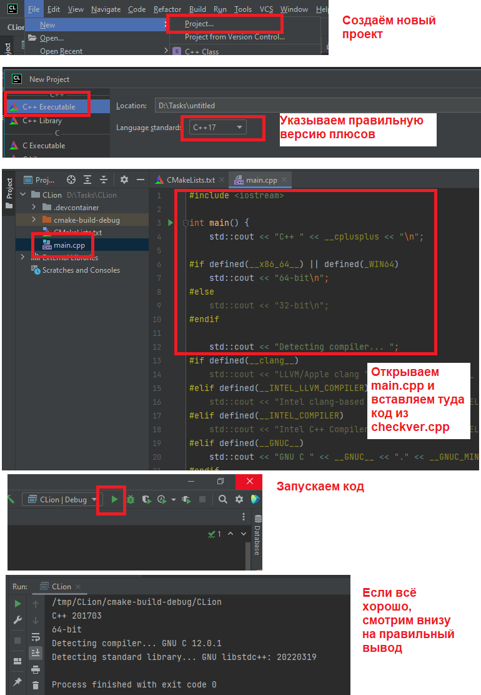
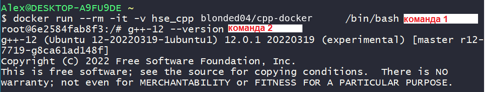
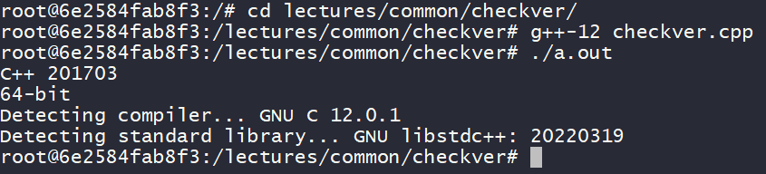
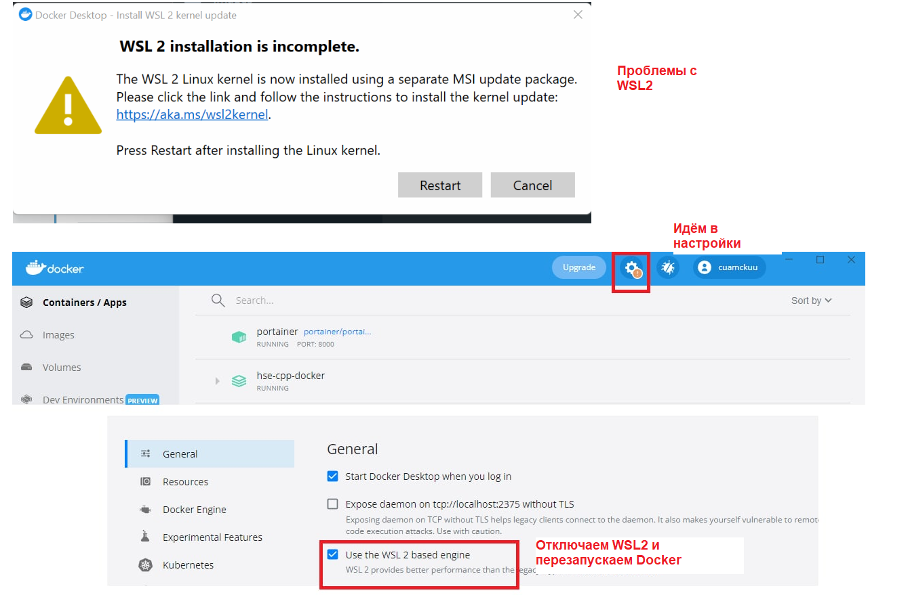
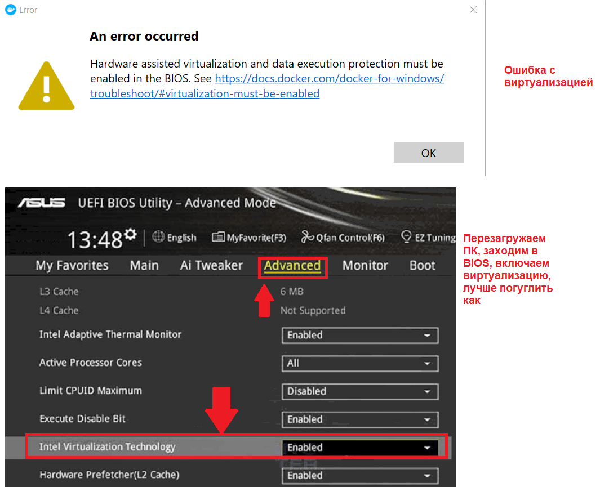
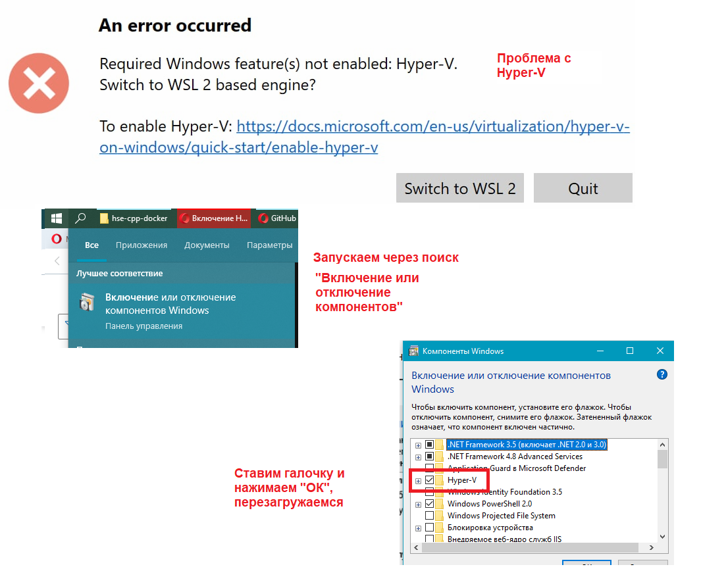

# HSE C++ Docker

Docker образ с зависимостями необходимыми для прохождения курса по C++

## Установка

1. Установить [Docker Desktop](https://www.docker.com/products/docker-desktop/) (При возникновении проблем, см. пункт "Проблемы с докером" ниже)
2. Установить [git](https://git-scm.com/downloads), если его нет, пока не нужен, но пригодится позднее
3. Открыть консоль/терминал/PowerShell и выполнить команду `docker pull cuamckuu/hse-cpp:v1.0.0`
4. Скачать и установить [CLion](www.jetbrains.com/clion/download/)

## Настройка и запуск CLion

В целом используем [этот гайд](https://www.jetbrains.com/help/clion/clion-toolchains-in-docker.html).

Если кратко: Нужно зайти в настройки и указать всё как на скрине:

## Запуск в консоли

1. Открываем консоль/терминал/etc. в какой-нибудь рабочей папке проекта
2. Клонируем нужный репозиторий с проверками компилятора `git clone https://github.com/hse-spb-2022-cpp/lectures.git`. Должна появиться папка с названием 'lectures'
3. Запускаем команду `docker run --rm -it -v ${PWD}:/hse-cpp -w /hse-cpp cuamckuu/hse-cpp:v1.0.0 /bin/bash`. Это запустит консоль в той же папке, но с доступом к компиляторам
4. Вывод консоли меняется, что говорит о том, что мы внутри контейнера. Можно проверить версию компилятора `g++-12 --version`

5. Переходим в папку с нужными файлами `cd lectures/common/checkver/`
6. Компилируем файл `g++-12 checkver.cpp`
7. Запускаем файл командой `./a.out`
8. Сверяем Вывод

## Проблемы с докером

### Ошибка с WSL2

Либо отключаем поддержку WSL2, если не получается, то доставляем WSL2 по инструкции по ссылке из ошибки

### Ошибка с BIOS

### Ошибка с Hyper-V

